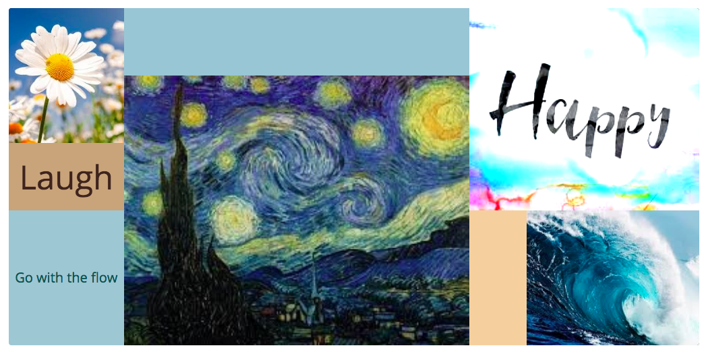
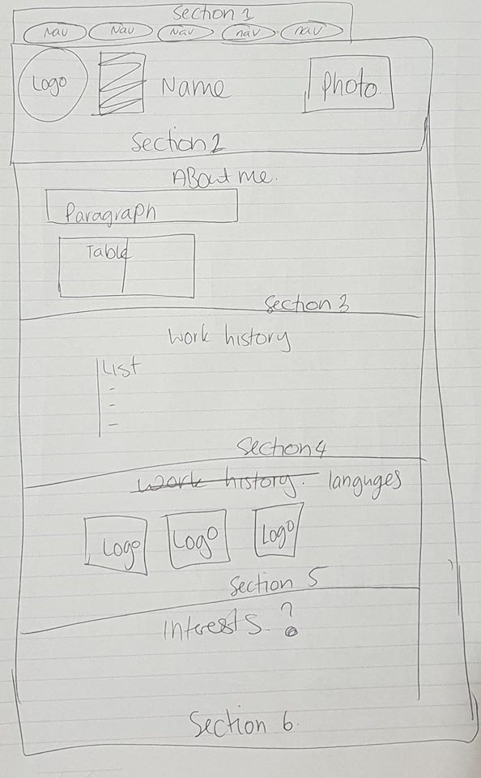
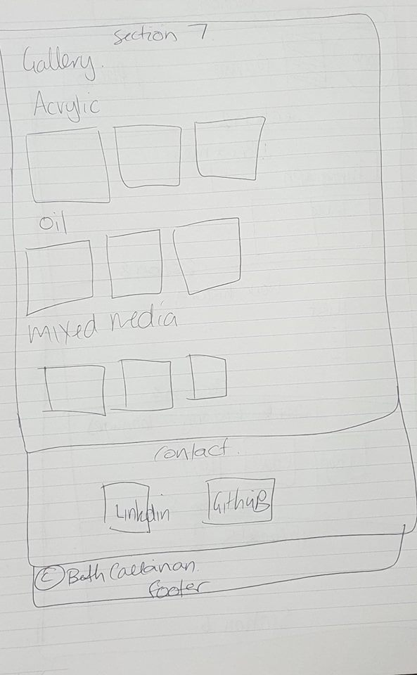
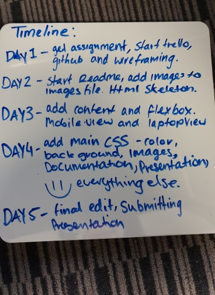
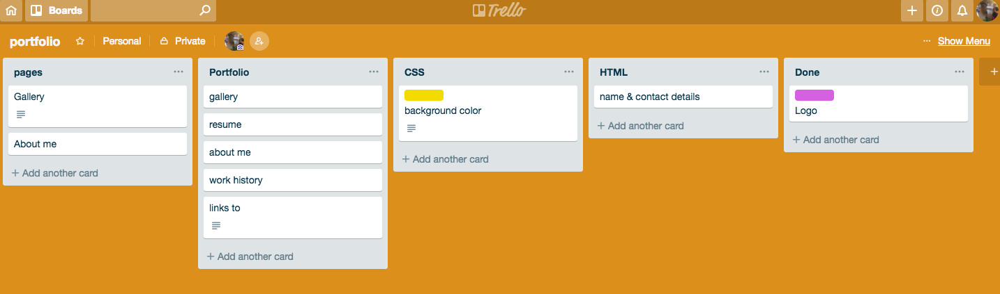
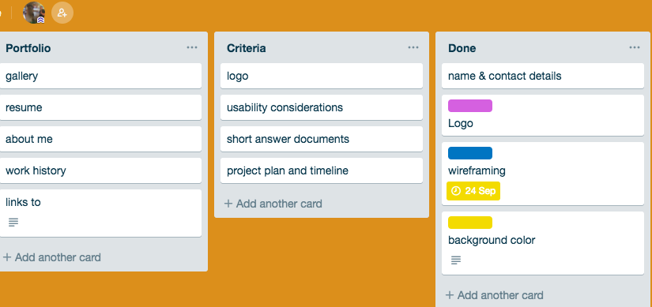

# My Portfolio

## Portfolio
https://beth94victoria.github.io/

##  GitHub repo
https://github.com/beth94victoria/Portfolio/blob/master/README.md

## Description
This portfolio is
### Purpose
The purpose of this portfolio is to entertain the viewer with a simple design and easy to follow links, to put my personality on a web page without scaring people away.
### Functionality / features
It has a navigation tab at the top of the webpage that takes you to various sections on the page. At the bottom of the page there is links to my Github and linkedin that will take you to a new tab. 
### Sitemap
from the navigation bar at the top of the page you can get to all the sections on the one page. 

### Screenshots

### Target audience
There are two types of people I am targeting, It has to be professional enough to attract the attention of potential employers yet easy to read and navigate so that friends and family can also get enjoyment out of it.
### Tech stack (e.g. html, css, deployment platform, etc)
Html5
Scss

## Design documentation

### Design process

### Wireframes

### Personal logo 

### Usability considerations
Although none right now there will be two considerations added in the future:
    1. A colour blind option that uses pattern and dots in greyscale instead of colour.
    2. Screen reader that not only read the text but describe the paintings.

## Details of planning process

### Project plan & timeline

### Screenshots of Trello board(s)

## Short Answer Q&A - Include short answers to the following questions,
1. Describe key events in the development of the internet from the 1980s to today (max. 150 words)

The domain name system (DNS) was established in 1984 and network adresses were identifed by extensions such as .com .org. In 1989 Tim Berners-Lee developes the Hypertext, creating www. the world wide web. The term BLOG was first coined as WEB BLOG in 1997 following July 8th when a NASA website broadcasted images taken on Mars, google opened their first office one year later, napster and myspace in 1999. 
2003 was a big year for the internet whith spam emails accounting to half of all emails, Apple introduces itunes, the cost of a song is 99c, not exacty stopping the 2.6 billion illegally downloaded music files being downloaded each month. Facebook was founded in 2004 by Mark Zuckerberg and youtube was launched, by 2006 there are more than 100 million websites online. Today there are 1.8 billion websites in the world. 

2.  Define and describes the relationship between fundamental aspects of the internet such as: domains, web servers, DNS, and web browsers (max. 150 words)

A web server is a program that uses HTTP (Hypertext Transfer Protocol) to process and send web pages to a user in response to a user request. Domains are the network adresses that share a common suffix such as .com or .edu marking them for the users recognition. Web browsers are the software organisations used to access the world wide web, Internet explorer and google chrome are these such browers. The thing connecting all of these aspects is a user; we jump on a browser, type in a domain name such as facebook.com a web server finds this and we recieve it on our computer. 

3.  Reflect on one aspect of the development of internet technologies and how it has contributed to the world today (max. 150 words)
most of the technologies used today have a positive impact on the world today, my favourite web application is IMDB, as a lover of movies and trivia it comes in handy when I absolutely need to know when Hugh Jackman was born, or when Titanic was released. It
